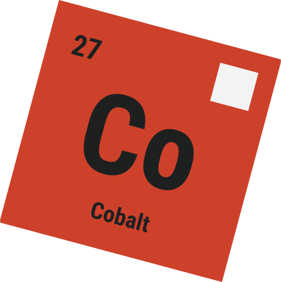

<p align="right">
    <a href="https://cobalt.plainenglish.xyz"></a>
</p>

<h1 align="center">Cobalt</h1>

A Luau [Rust](https://rust.facepunch.com/) RCON Bot library.


## About

Cobalt allows you to listen to Rust server events and respond by performing 
in-game actions.

Cobalt works by attaching to the server's RCON interface, listening for events
(by periodically sending commands and parsing server logs), and sending commands
back to perform actions.

## Example

The following is an example kit bot:-

```luau
local cobalt = require("@cobalt/")

local bot = cobalt.Bot.new()

bot.started:connect(function()
	print("Bot online")
end)

bot.chatted:connect(function(player: cobalt.Player?, message: string)
	if not player then
		return
	end

	if message == "!kill" then
		player:kill()
	elseif message == "!kick"
		player:kick()
	elseif message == "!kit"
		player:give_item("rifle.ak")
		player:give_item("ammo.rifle", 128)
	end
end)

bot.errored:connect(function(err: cobalt.Error)
	print(`Cobalt {err.source.type} error: {err.message}\n{err.traceback}`)
end)

bot:run("localhost", "password123")
```

More examples can be found under `examples/`.
